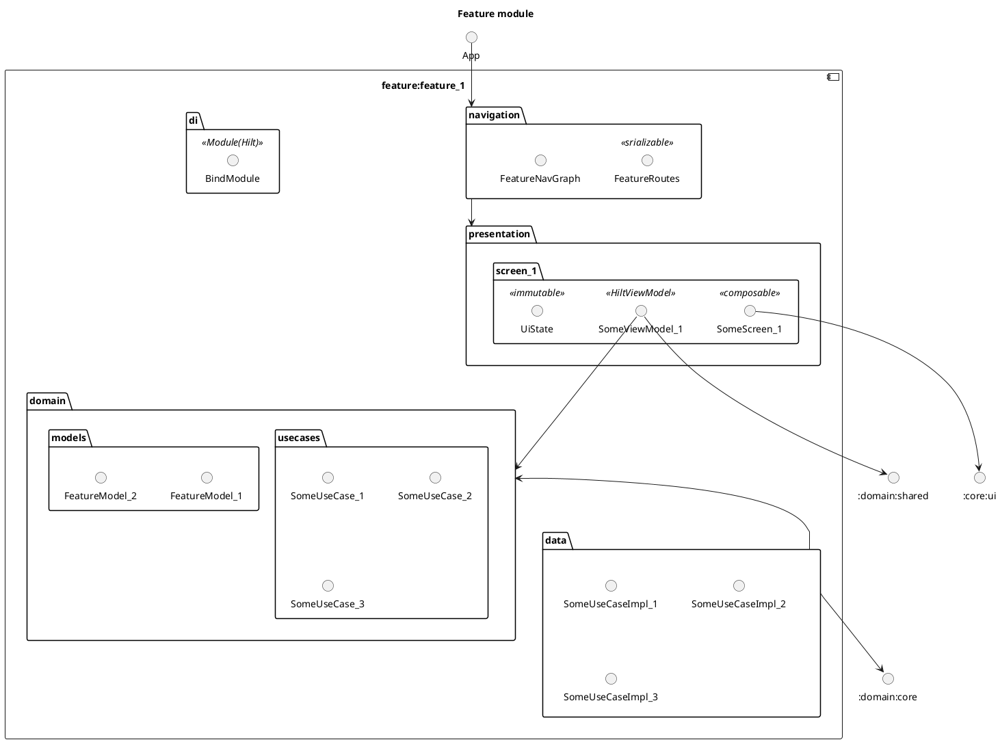

# Going ahead with Clean Architecture in Android. Example with complex navigation.
**Date of publication:** 17 Nov 2025

*Let's continue talking about Clean Architecture in Android.*

Unlike previous example we will move away out of __encapsulation__ principle. It's not so good but if we have some complex navigation when you have to move to different features and don't have a main menu or something like this, it's much more simple is making pubic routes than injecting navigation functions from NavGraph to each composable component.

---
*Here I wanna concentrate on navigation.*

## Example 2. Complex navigation.

### Requirements 

1. Platform is only Android (not CMP/KMP)
2. Our project is multi-module
3. The :app module have a navigation to each screen
4. The features have their own screens
5. The features are independent on each other
6. The feature **can** navigate to another feature directly
7. There's some pieces of data that have to be in many screens

### Structure

#### Generally structure



#### Navigation module
The navigation routes are keeping in this module.

```kotlin
sealed interface Feature1Routes {
    @Serializable
    data class Feature1Screen1(
        val somePieceOfData: String, //if needed
    ) : Feature1Routes

    @Serializable
    data object Feature1Screen2 : Feature1Routes
}

sealed interface Feature2Routes {
    @Serializable
    data class Feature2Screen1(
        val somePieceOfData: Int, //if needed
    ) : Feature2Routes

    @Serializable
    data object Feature2Screen2 : Feature2Routes
}

//etc
```

#### Feature module
Depends on:

- :core:ui - common UI components
- :domain:core - models and repositories
- :domain:shared - common UseCases
- :navigation - navigation routes

Packages:

- **navigation** - Here are part of navigation graph. The only module that has `public` modifier.
*Other have `internal`.*
- other are the same of [previous example](./android-ca-independent-features.md#feature-module)

So, we have an opportunity to navigate to another feature directly from feature screen.

```kotlin
@Composable
internal fun SomeScreen(
    navController: NavHostController,
    viewModel: SomeViewModel = hiltViewModel()
) {
    SomeComposableFun(
        onClick = { 
            navController.navigate(Feature2Routes.Feature2Screen2) 
        }
    )
}
```
OK, OK... I know what you'll say. **It's a bullshit! Where's you "Clean" Architecture? High coupling, cross dependencies and so on...**

Guys, I've known about it. And I agree with you. But it's better than you'll have something like this:
```kotlin
@Composable
internal fun SomeScreen(
    navigateBack: () -> Unit,
    navigateToScreen1: () -> Unit,
    navigateToScreen2: () -> Unit,
    navigateToScreen3: () -> Unit,
    //etc
    viewModel: SomeViewModel = hiltViewModel()
) {
    //some code
}
```

### PreSummary
So, It was a directly pragmatic approach. And it works...

*Okay, let's try to make some better solution*

### More cleaner solution
We can do some contract for navigation in `:navigation` module, such as:
```kotlin
interface Feature1Navigator {
    fun navigateToFeature2Screen1()
    fun navigateToFeature2Screen2()
    fun navigateToBack()
}
```

And inject it into ViewModel:
```kotlin
@HiltViewModel
internal class SomeViewModel @Inject constructor(
    private val navigator: Feature1Navigator
) : ViewModel() {
    fun navEvent() {
        navigator.navigateToFeature2Screen2()
    }
}
```

The implementation can be placed in `:navigation` module or you can create a difference `:navigation:impl` for lesser coupling.

### Summary
So, there was 2 solutions:

- dirty but directly
- clear with DIP

---
*I think I have to repeat the bottom part of article.*

In text above was certain example with certain requirements, and that solution can not be applied for another type of project. **Do not copy without thinking.**

*Thanks for reading!*
