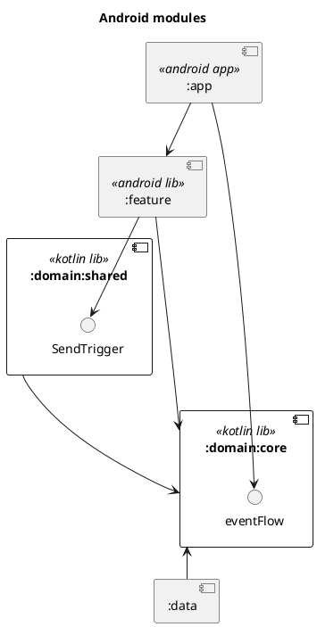

# More about Clean Architecture in Android. Example with cross-cutting features.
**Date of publication:** 04 Dec 2025

*Okay, here's the next part.*

And now I gonna talk about features that cross though the whole app such as: exceptions, dialogs, global events etc. I mean features whose behavior depends on others.The main concept is making some [SSOT](https://en.wikipedia.org/wiki/Single_source_of_truth) for global events and subscribe to it in the main module. And the [Flows](https://kotlinlang.org/docs/flow.html) will help us for that goal.

For this purpose I'll use [SharedFlow](https://kotlinlang.org/api/kotlinx.coroutines/kotlinx-coroutines-core/kotlinx.coroutines.flow/-shared-flow/). It was especially created for this kind of cases.

---

## Example 3. Cross-cutting features.

### Requirements 

1. Platform is only Android (not CMP/KMP)
2. Our project is multi-module
3. The features have their own screens
4. Any feature can send some trigger
5. The features are independent on each other

### Structure

#### Generally structure



#### Domain module

As usual **domain module** is independent on each other. It's a keeper of `interface GlobalRepository` and `enum GlobalEvent`

```kotlin
interface GlobalRepository {
    val eventFlow: SharedFlow<GlobalEvent>
    fun sendTrigger(trigger: Trigger)
}

enum class Trigger {
    SOME_TRIGGER_1,
    SOME_TRIGGER_2,

//etc
}

enum class GlobalEvent {
    SOME_EVENT_1,
    SOME_EVENT_2,

//etc
}
```

#### Domain shared module

This module depends on `:domain:core` module. So, here's only *set* interface and it's implementation and *DI*, obviously.

```kotlin
interface SendTrigger {
    operator fun invoke(trigger: Trigger) //or suspend fun if needs
}

class SendGlobalEventImpl @Inject constructor(
    private val repository: GlobalRepository
) : SendTrigger {
    override fun invoke(trigger: Trigger) = repository.sendTrigger(trigger)
}
```

#### Data module

```kotlin
class GlobalRepositoryImpl @Inject constructor(
    //some injected entities such as dispatcher or scope if needs
) : GlobalRepository {
    private val _eventFlow = MutableSharedFlow<GlobalEvent>()
    
    override val eventFlow = _eventFlow.asSharedFlow()
    
    override fun sendTrigger(trigger: Trigger) {
        when(trigger) {
            //some logic
            someScope.launch { _eventFlow.emit(event) }
            //some logic
        }
    }

//etc
}
```

I didn't stop on parameters of flow (such as replay, buffer), it depends on a certain case.

#### App and feature modules

In the **app module** you can inject an interface on Repository directly from the `:domain:core` or you can make an interface only for getting flow of events. In the **feature module** you inject the `SendTrigger` from `:domain:shared`. How to work with **feature module** you may see in the [previous article](./android-ca-independent-features.md#feature-module).

### Summary
I remain consistent with the same principles as in previous articles ([part 1](./android-ca-independent-features.md), [part 2](./android-ca-complex-navigation.md)).

- single independent `:domain:core`
- shared interfaces
- data module as [SSOT](https://en.wikipedia.org/wiki/Single_source_of_truth)

---

*This approach some similar with approach in the article [Sharing data between ViewModels](../sharing-data-between-viewmodels.md) but applyed in larger scale. Hmm... yeah, I like it :fontawesome-regular-face-smile:*

*As usual, warning at the end.*

In text above was certain example with certain requirements, and that solution can not be applied for another type of project. **Do not copy without thinking.**

*Thanks for reading!*
