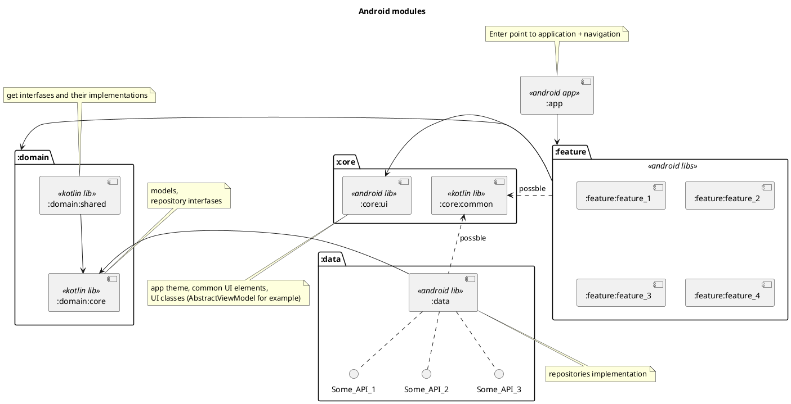
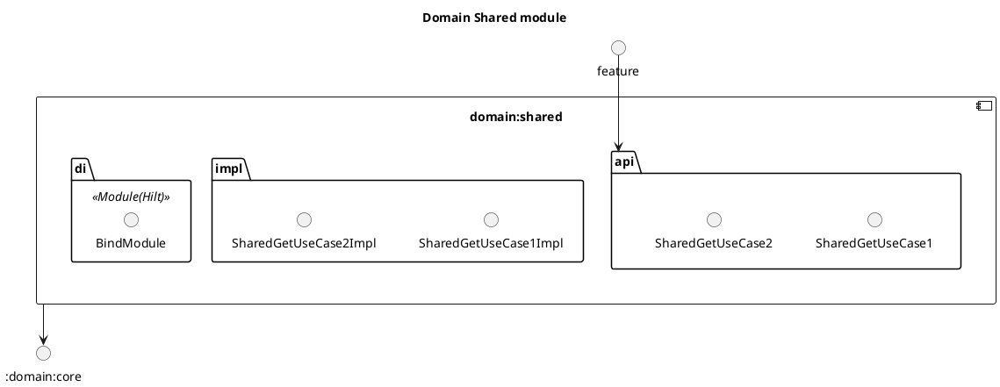
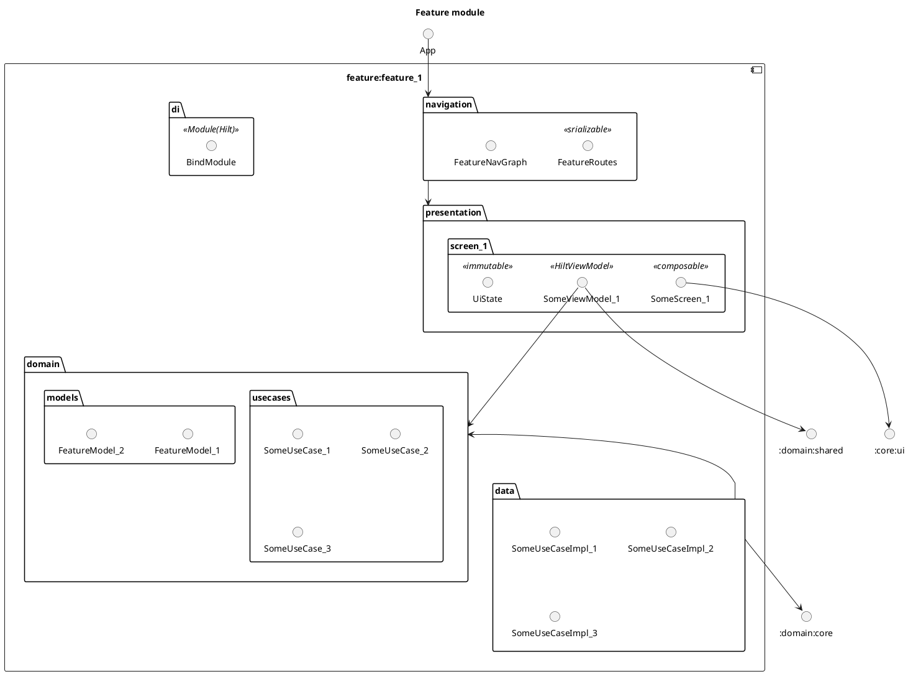

# Intro to Clean Architecture in Android. Example with independent features. 
**Date of publication:** 10 Nov 2025

## Intro
There are lots of articles about Clean Architecture:

- [Google guide](https://developer.android.com/topic/architecture)
- [Google search](https://www.google.com/search?q=android+clean+architecture)
- [Google Gemini](https://www.google.com/search?q=android+clean+architecture&udm=50&fbs=AIIjpHxU7SXXniUZfeShr2fp4giZ1Y6MJ25_tmWITc7uy4KIeoJTKjrFjVxydQWqI2NcOhYPURIv2wPgv_w_sE_0Sc6QqqU7k8cSQndc5mTXCIWHa5yWh8UZLeaMB2TzsL707pcnajOVzuG8nS7sxlcHlHT7cLHEsNnGrA7u6eJqizJIVn4bAZJhxiQ_p9h3E1L5D4qlMKnP-aQXBIIHnP3WnQdd-Mmhzw&ved=2ahUKEwijnprIhOGQAxXVnf0HHbibGvEQ0NsOegQIOBAA&aep=10&ntc=1&mstk=AUtExfCb2XbKzgnqakTo_O5wA2sOqY7X-TLshBNYoSZngI5OmoOWqBsj0o-C23xgb1ldfrfoBf1Acsr3yA3JeWCgzSSSrZXxjLveCuNEMIHjoZxp1vgI3clahTEQf6zwCaS8kBbVdlYhAtqUhUQ6h1Dgnbi_65TPh98-0UE&csuir=1) he, he..

So, I don't wanna copy those guides and my advice is **read them carefully**. But I have to write about **domain layer** for excluding confusion of terms.

### Domain layer
There is something wrong with understanding **domain layer** in the Android development context. Here's the quote from the [Google guide](https://developer.android.com/topic/architecture/domain-layer):

> Note: The term "domain layer" is used in other software architectures, such as "clean" architecture, and has a different meaning there. Don't confuse the definition of "domain layer" defined in the Android official architecture guidance with other definitions you may have read elsewhere. There may be subtle but important differences.

The common pattern of software architecture says that the **domain layer** is **business-logic**. But what is **business-logic** in Android development context? - It's not about **Enterprise** rules, it's about how **transform data for showing** on the smartphone's screen. There is no complex rules or something else. 

Of course, you may have not simple rules for showing data. You may have caching, paging, aggregation, complex calculation, rendering etc. But the core questions are: 

1. How we show data for user? 
2. How we collect user's input?

Okay, in the examples below I'll use **domain layer** as layer with reusable logic with *UseCases* as in the [recommendations](https://developer.android.com/topic/architecture/domain-layer#reusable-logic).

On the other side, I try to make **domain layer** as independent layer regardless of [Google diagram](https://developer.android.com/topic/architecture#recommended-app-arch) where we see dependency to **data layer**. This is a turn to a classic Clean Architecture.

So, the domain layer consists from interfaces of UseCases, data classes of models, independent (from other libraries) clear Kotlin logic that is need in many features.

### UseCases
Another point I wanna write about *UseCases*. There is a common pattern to make *UseCases* as single function, such as:

```kotlin
class SomeUseCaseImpl @Inject constructor(
    private val someRepo: SomeRepository
): SomeUseCase {
    override suspend fun invoke() = someRepo.someAction()
}
```

I don't like this approach. I see in this more complex solution that have to be. You may say: *"Bro, it's a __Single responsibility__ principle from SOLID"*. But in general this is just sophistry, example functions: `getMoney()`, `saveMoney()`, `changeMoney()` etc. Do each of these functions have **Single responsibility**, or we can say that the `MoneyUseCase` with those all functions has **Single responsibility** of working with money?

*Got an idea? Credo: __Less boilerplate, more code elegance__*

---
*In the multi-modules projects the Clean Architecture is the crucial point for maintain in future. So, I'll concentrate in this kind of projects in my examples.* 

## Example 1

### Requirements

1. Platform is only Android (not CMP/KMP)
2. Our project is multi-module
3. The **:app** module have a navigation to each screen
4. The features have their own screens
5. The features are independent on each other
6. The feature can't navigate to another feature directly
7. There's some pieces of data that have to be in many screens

### Structure

#### Generally structure



#### Domain Core module
- Has data classes and interfaces of repositories. 
- It's an independent module. 
- Often it's only Kotlin library, but not always.

I think I have to move attention to library type. The common way is making **domain** module as Kotlin library. And it's correct way, the best solution... ideal... 
But sometimes we have to move away from this pattern. And the main problem is in the resources and annotations:

- Annotations `@StringRes`, `@DrawableRes` etc. is needs in `androidx.annotation:annotation` library.
- Also we wanna add some resources as params, such as
```kotlin
enum CustomErrors(val messageResId: Int) {
    ERROR_1(R.string.err_1_msg),
    ERROR_2(R.string.err_2_msg),
    //etc
}
```

So, what can I say? - Do it. Make module as Android library. It's wrong and it's not a canonical way... but it's much more simple for maintain in future.

#### Domain Shared module
Here are the single-line UseCases and their implementations. The module depends on only **:domain:core**.



#### Feature module
Depends on:

- :core:ui - common UI components
- :domain:core - models and repositories
- :domain:shared - common UseCases

Here you are packages:

- **navigation** - Here are navigation routes, part of navigation graph. The only module that has `public` modifier.
*Other have `internal`.*
- **presentation** - Composable functions, ViewModels, UiStates... as usual... One point - in ViewModel we also have to inject shared UseCases from **:domain:shared** we need in.
- **domain** - Feature UseCases
- **data** - Implementations of feature UseCases



### Summary
So, I tried to make an optimal architecture tailored to project's set of requirements.

- data module as [SSOT](https://en.wikipedia.org/wiki/Single_source_of_truth)
- domain module as a model
- feature module as a UI
- app module as a glue

---
You know, there are no universal scheme for organizing modules and creating architecture. It depends on requirements. In text above was certain example with certain requirements, and that solution can not be applied for another type of project. 

**Do not copy without thinking.**

*Okay, it's all for now. Thanks for reading!*

