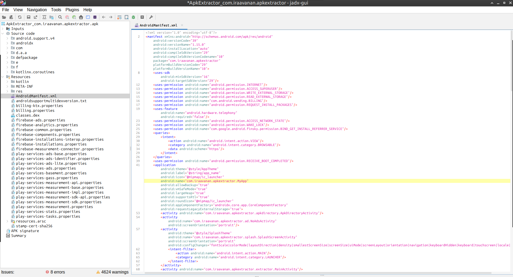

# Simple example of reverse .apk (removing Ads)
**Date of publication:** 10 Mar 2025

Okay, today I gonna do some simple reverse engineering on Android application. As an example I get an amazing application [Apk Extractor Fastest & Suppor](https://play.google.com/store/apps/details?id=com.iraavanan.apkextractor)

### Tools
- [JADX](https://github.com/skylot/jadx) - for discovering code in Java
- [Apktool](https://apktool.org/) - for editing code in Smali
- [Android SDK build tools](https://developer.android.com/tools) - for compress and sign

### Process

#### Get .apk file by [Apk Extractor Fastest & Suppor](https://play.google.com/store/apps/details?id=com.iraavanan.apkextractor) itself.


What we see? We see a terrible Ads in so wonderful application.

#### Discover Java code
- open our .apk by [JADX](https://github.com/skylot/jadx)

And we can see something like this:


- Fist of all we have to see `AndroidManifest.xml`.
*Oh, bro, thanks a lot!*
```xml
<activity
android:name="com.iraavanan.apkextractor.ad.NoAdsActivity"
android:screenOrientation="portrait"/>
```
- Let's see `NoAdsActivity`, obviously. 

The path in the JADX is 

`Source code/com.iraavanan.apkextractor.ad.NoAdsActivity`.
```java
protected void onCreate(Bundle bundle) {
    super.onCreate(bundle);
    setContentView(R.layout.activity_no_ads);
    ActionBar supportActionBar = getSupportActionBar();
    if (supportActionBar != null) {
        supportActionBar.setTitle(getString(R.string.premium));
    }
    ActionBar supportActionBar2 = getSupportActionBar();
    if (supportActionBar2 != null) {
        supportActionBar2.setDisplayHomeAsUpEnabled(true);
    }
    com.iraavanan.apkextractor.g.f fVar = com.iraavanan.apkextractor.g.f.a;
    if (fVar.b(this).getBoolean(getString(R.string.is_premium), false)) {
        J();
        return;
    }
// some code
```
*OMG, bro, do you really keep a premium flag in SharedPreferences?!*

*When I saw it I thought to get another example, but it's OK. It's simple and visible.*

#### Extract and change Smali code

- Execute apktool: 

`/opt/apktool/apktool d ApkExtractor_com.iraavanan.apkextractor.apk`

So we've got a folder `ApkExtractor_com.iraavanan.apkextractor` with Smali code. You can open this folder as a project in Android Studio. Our activity in on the same path: `smali/com.iraavanan.apkextractor.ad.NoAdsActivity.smali`

- look for the condition in the `onCreate()` function

```smali
:cond_1
sget-object p1, Lcom/iraavanan/apkextractor/g/f;->a:Lcom/iraavanan/apkextractor/g/f;

invoke-virtual {p1, p0}, Lcom/iraavanan/apkextractor/g/f;->b(Landroid/content/Context;)Landroid/content/SharedPreferences;

move-result-object v0

const v1, 0x7f10004a

invoke-virtual {p0, v1}, Landroid/app/Activity;->getString(I)Ljava/lang/String;

move-result-object v1

const/4 v2, 0x0

invoke-interface {v0, v1, v2}, Landroid/content/SharedPreferences;->getBoolean(Ljava/lang/String;Z)Z

move-result v0

if-eqz v0, :cond_2

invoke-direct {p0}, Lcom/iraavanan/apkextractor/ad/NoAdsActivity;->J()V

goto/16 :goto_1
```

Looks not so nice :) Let's define what happens. [Dalvik opcodes](http://pallergabor.uw.hu/androidblog/dalvik_opcodes.html)

- `sget-object p1 //etc` - we are getting some object and put it into `p1`
- `invoke-virtual {p1, p0} //etc` - execute some function on `p1` object, `p0` is the pointer to our activity... possibly :) It looks like we've got SharedPreferences
- `move-result-object v0` - put SharedPreferences into `v0`
- `const v1, 0x7f10004a` - some const similar like ID of resource
- `invoke-virtual {p0, v1} //etc` - activity of `p0` getting string resource by `v1` ID
- `move-result-object v1` - put that string into `v1`
- `const/4 v2, 0x0` - define the *false* constant
- `invoke-interface {v0, v1, v2} //etc` - our key function what defines premium
- `move-result v0` - result of function into `v0`
- `if-eqz v0, :cond_2` - if our result is *0(false)* the program go to `:cond_2`

Obviously, we have to change the result of function.
```
move-result v0

const/4 v0, 0x1

if-eqz v0, :cond_2
```

#### Pack to .apk
- build an .apk file

`/opt/apktool/apktool b ApkExtractor_com.iraavanan.apkextractor -o apkextractor.apk`
- compress .apk

`zipalign -v -p 4 apkextractor.apk apkextractor_compressed.apk`
- create key for signing by [keytool](https://docs.oracle.com/javase/8/docs/technotes/tools/unix/keytool.html#keytool_option_genkeypair)

`keytool -genkeypair -v -keystore release-key.keystore -alias apkextractor -keyalg RSA -keysize 2048`
- sign

`apksigner sign --ks release-key.keystore --ks-key-alias apkextractor --out apkextractor_signed.apk apkextractor_compressed.apk`

#### Install and run
- remove the base app version

`adb uninstall com.iraavanan.apkextractor`
- install changed version

`adb install apkextractor_signed.apk`
- run


*Hmm... something went wrong...*

Okay, maybe I should go to premium option in the app.


Let's recreate activity by `Back` button or rotate screen.


So... that's all, no Ads.

---

*What do I wanna say at the end? Don't keep premium flags inside the app.*

*Thanks for your attention!*
